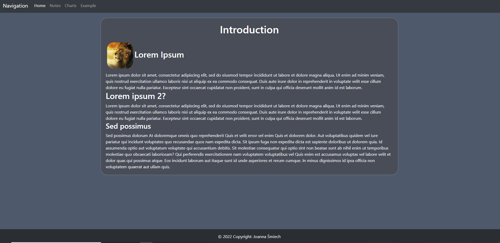
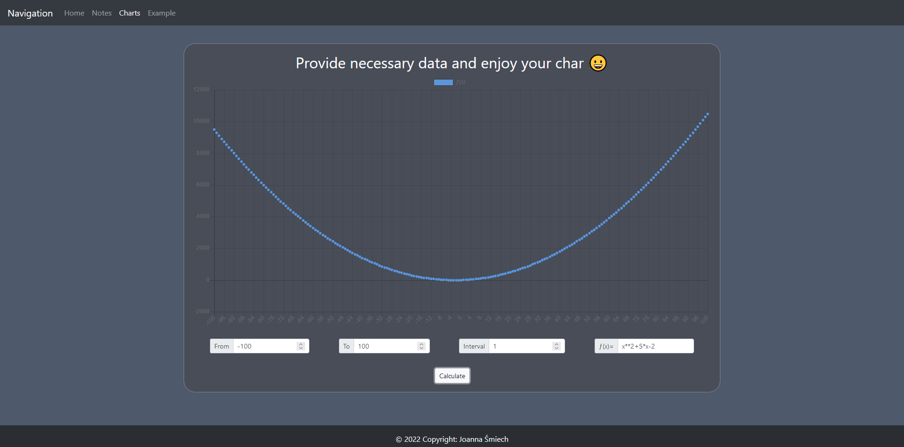

# Page project

## Introduction page

Just introduction page for future use. For now it is filled with example text.

## Notes Page

Page allows user to add notes. For now it is not integrated to serwer with any datasource, but allows to add elements to page only.

## Charts page

Page allows user to prepare charts by few given parameter: From, to, interval and f(x). After filling all of these values and confirming by calculate button user will see chart that will display function values for given input.

